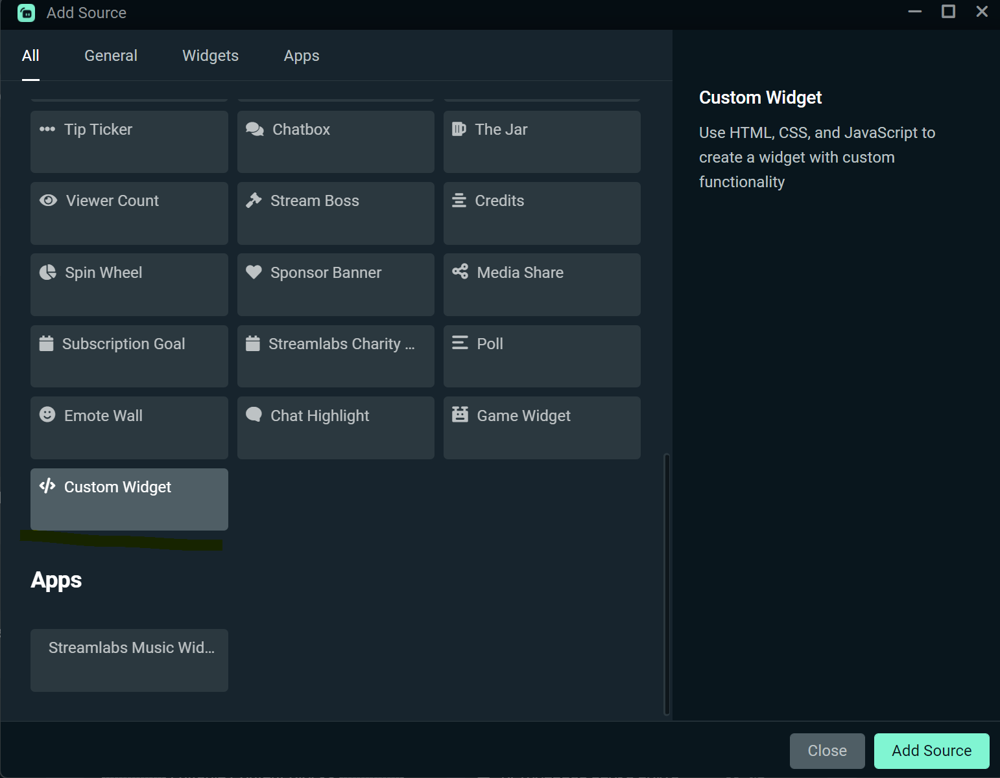
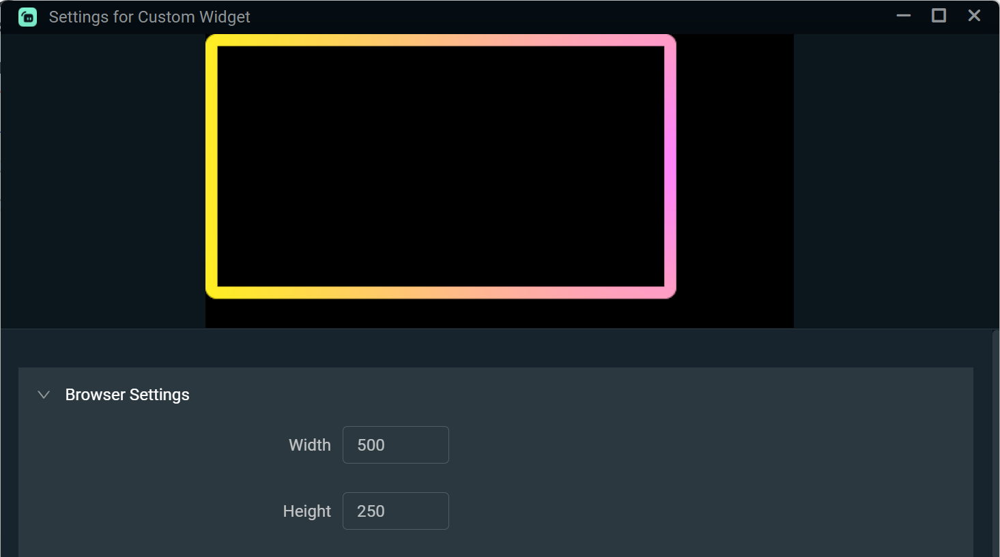
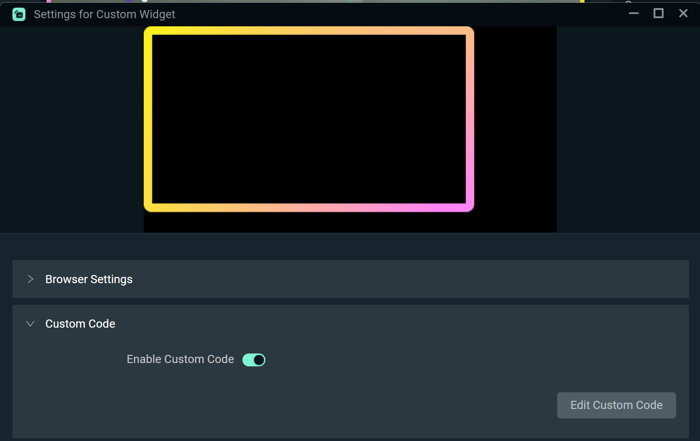
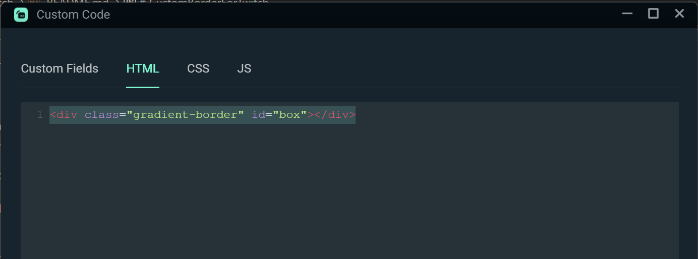

# CustomBorderForTwitch

You can use this code to customize the animated border. E.g. you can use it for your streams at Twitch.

You can changes variables located in `:root` css selector in style.css file to adjust the border:

The size:
`--borderWidth: 10px; // thickness of the border`  
`--borderRadius: 10px; // sharpness of the corners` 
`--width: 400px; // size` 
`--height: 225px; // size` 

The colors:
`--hue: 300; // range is from 0 to 360` 
`--hueOffset: 120;  // range is from 0 to 360` 
`--level: 50%; // range is from 0 to 100%` 
`--brightness: 75%; // range is from 0 to 100%` 

The speed of animation:
`--duration: 5s; // any number - the lower number, the faster animation`

How to apply it in OBS:

1. In your Scene -> Add source -> Custom Widget:
   

2. Browser Setting -> edit the width and heigth for your border to fit in:
   

3. Custom Code -> Edit Custom Code:
   

Add this line of code into html code:
`

`

4. Add everything from style.css into css tab.

Feel free to contact me in case of any questions.
